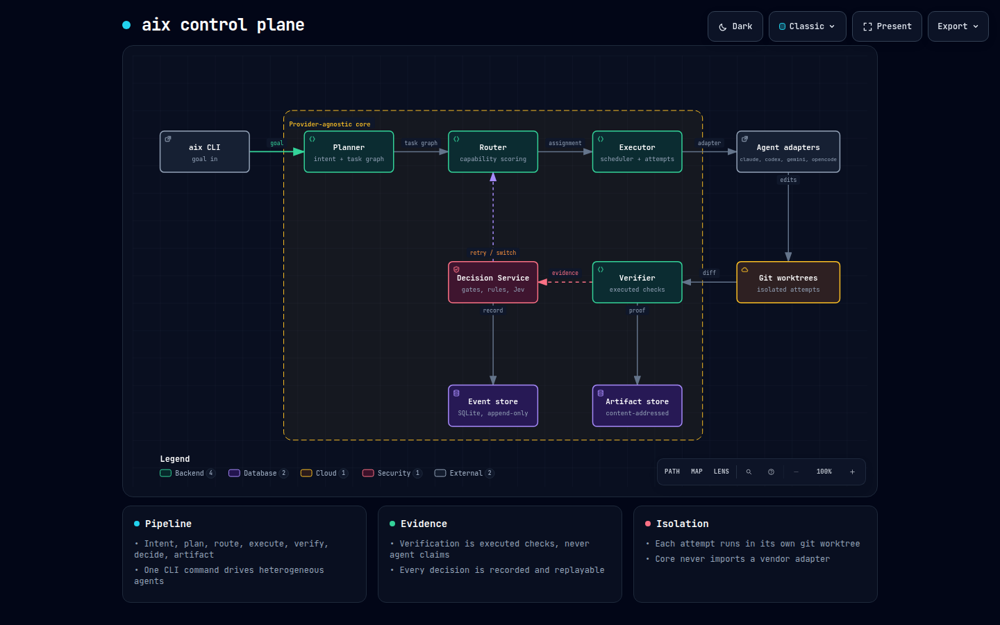

# aix — Universal AI Agent Control Plane

**One command takes a coding goal, splits it across heterogeneous AI agents, verifies the result
independently, makes explicit recorded decisions (retry / accept / escalate), and emits an evidence
trail — with no manual coordination.**

aix sits *above* agents such as Claude Code, Codex CLI, Gemini CLI and OpenCode. Agents do the work;
aix owns orchestration, state, policy and evidence.

```text
Intent → Plan → Route → Execute → Verify → Decide → Artifact
```



*Interactive version: [`docs/diagrams/aix-architecture.html`](docs/diagrams/aix-architecture.html)
(open locally; source spec in `aix-architecture.json`).*

## Principles

- **Verification is evidence, not claims.** Build, tests, lint, typecheck, secret/SAST/dependency
  scans and policy checks are *executed*; an agent saying "all tests pass" counts for nothing.
- **Provider-agnostic core.** The core never imports a vendor adapter; an import-linter contract
  enforces it. Every vendor quirk lives in one adapter.
- **Isolation.** Each attempt runs in its own git worktree; results land on branch `aix/run/<id>`
  and are merged by you.
- **Typed, recorded decisions.** Hard gates first, then a provider (rule-based by default, Jev
  optional). Every decision is stored with its inputs hash and is replayable.
- **Human approval where it matters.** High-risk plans and gated commands wait for `aix approve`,
  which requires a TTY or a token and refuses to run inside an agent.

## Install

Requires Python 3.12+, git and [uv](https://docs.astral.sh/uv/).

```bash
git clone https://github.com/tanmoy162111/AIX.git
cd AIX
uv sync --all-extras
uv run aix --help
```

Agent CLIs (`claude`, `codex`, `gemini`, `opencode`) are optional; `aix doctor` reports what it
finds, and a built-in `fake` agent exists for tests and demos.

## Quick start

```bash
cd your-project            # must be a git repository
uv run aix init            # .aix/, default config, toolchain detection
uv run aix doctor          # which agents, tools and keys are available
uv run aix run "Add a retry option to the HTTP client" --plan-only   # see the plan
uv run aix run "Add a retry option to the HTTP client"              # route + execute + verify
uv run aix status <run-id>
git merge aix/run/<run-id>
```

Useful flags: `--budget-usd`, `--max-parallel`, `--scope <glob>`, `--decision-provider rules|jev`,
`--agent <id>` (single-agent mode), `--json`. Exit codes: `0` success, `1` failed, `3` waiting for
approval, `4` cancelled, `6` budget exceeded.

| Command | Purpose |
|---|---|
| `aix run` / `status` / `cancel` | Execute and observe runs |
| `aix plan show` | Inspect a recorded plan |
| `aix verify` / `aix review` | Verify or independently review the current tree |
| `aix approvals` / `approve` / `deny` | Human decisions on gated steps |
| `aix agent list` / `aix skill list` | Inspect agents and skills |
| `aix config` / `aix dev eval-decisions` | Configuration and decision-quality evals |

## Repository layout

```text
src/aix/
  domain/         pure Pydantic models, enums, state machines (imports nothing else)
  core/           planner, router, scheduler, executor, retries, context fabric
  decision/       gates, rules provider, Jev provider, eval harness
  verification/   check runner, parsers, security checks, AI review
  agents/         adapter protocol + adapters (fake, claude, codex, gemini, opencode)
  artifacts/      content-addressed object store with provenance
  security/       redaction, approvals
  store/          append-only SQLite event store and projections
  cli/            Typer commands
tests/            unit, integration, adapter, golden scenarios, live (opt-in)
docs/playbook/    PLAYBOOK (spec), DECISIONS (ADRs), PROGRESS (milestones)
```

## Development

```bash
make check     # format, lint, typecheck (pyright strict on core/domain/decision), layers, tests
make golden    # end-to-end golden scenarios with fake agents
AIX_LIVE=1 make test-live   # live agent/Jev tests (needs the CLIs and keys; costs money)
```

The default test suite never calls a paid agent or network service.

## Status

aix is built milestone by milestone from [`docs/playbook/PLAYBOOK.md`](docs/playbook/PLAYBOOK.md);
progress is tracked in [`docs/playbook/PROGRESS.md`](docs/playbook/PROGRESS.md) and design choices in
[`docs/playbook/DECISIONS.md`](docs/playbook/DECISIONS.md).

| Milestone | Scope | State |
|---|---|---|
| M0–M2 | Scaffold, domain, event store, agent adapters | done |
| M3 | Planning, routing, scheduling, multi-agent runs | done |
| M4 | Verification (checks, security, AI review) | done |
| M5 | Decisions, Jev, retries, escalation, approvals | done |
| M6 | Context fabric: facts, handoffs, budgeted prompts, compaction | done |
| M7 | Artifacts, reports, observability, crash resume | in progress |
| M8–M10 | Security hardening, API and plugins, release | planned |

Live runs against real agent CLIs are opt-in and less exercised than the fake-agent suite.
